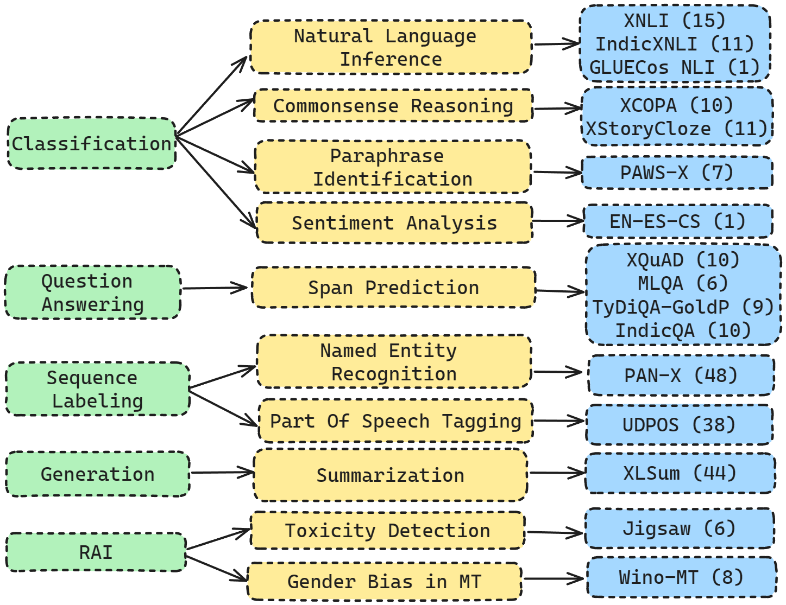
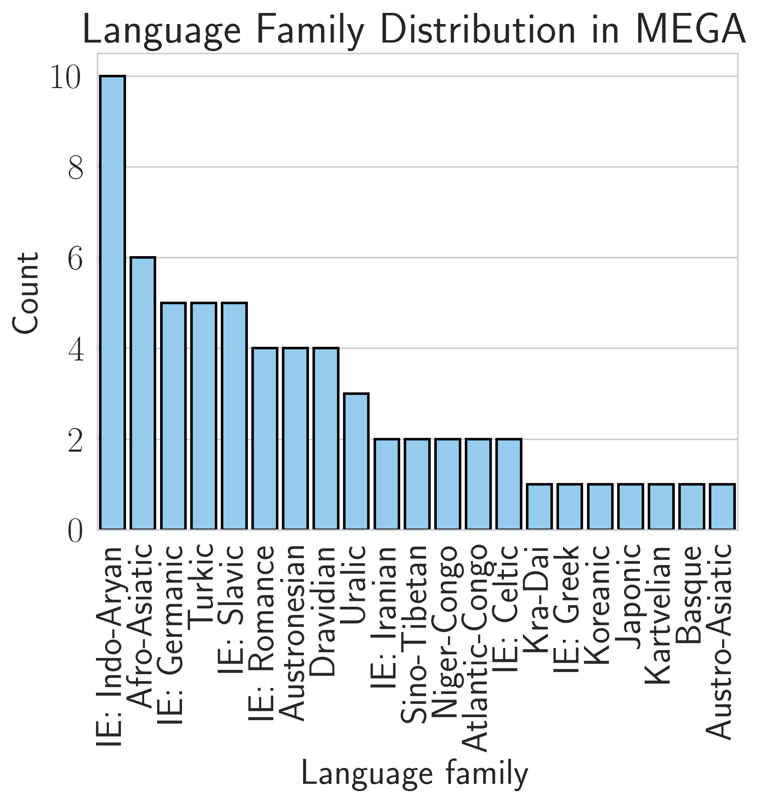
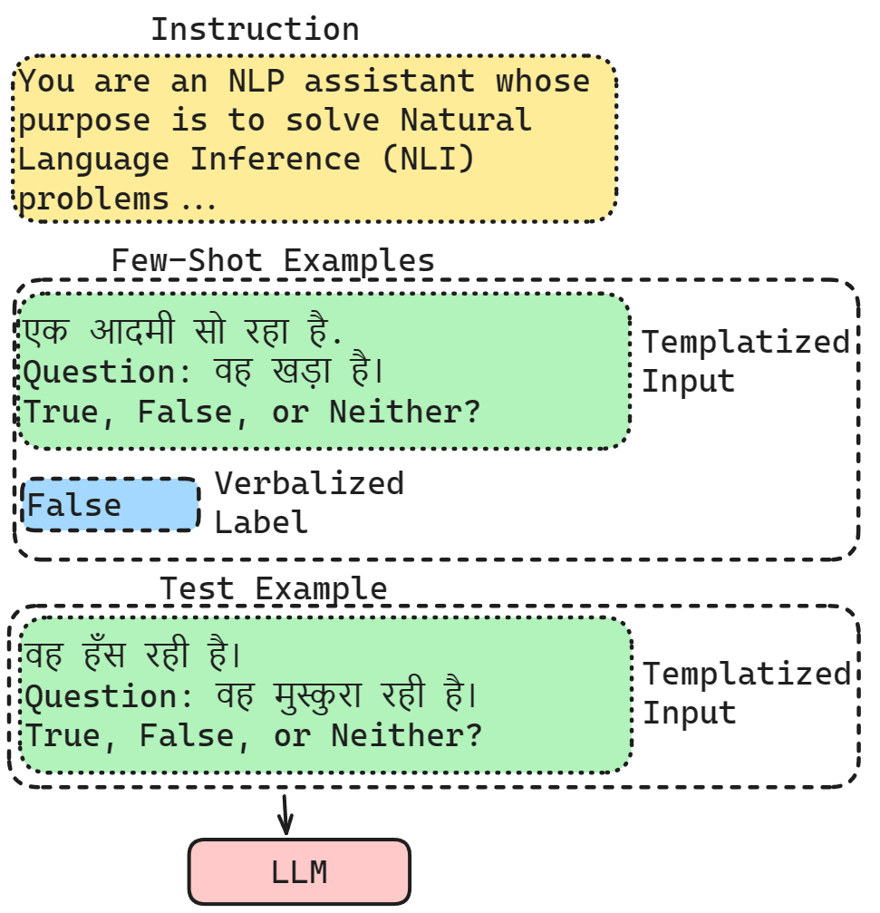

# MEGA
<h2 align="left">
  Official repository for the paper: "MEGA: Multilingual Evaluation of Generative AI"
</h2>

  
  
  

Generative AI models have shown impressive performance on many Natural Language Processing tasks such as language understanding, reasoning, and language generation. An important question being asked by the AI community today is about the capabilities and limits of these models, and it is clear that evaluating generative AI is very challenging. Most studies on generative LLMs have been restricted to English and it is unclear how capable these models are at understanding and generating text in other languages. We present the first comprehensive benchmarking of generative LLMs - MEGA, which evaluates models on standard NLP benchmarks, covering 16 NLP datasets across 70 typologically diverse languages. We compare the performance of generative LLMs including Chat-GPT and GPT-4 to State of the Art (SOTA) non-autoregressive models on these tasks to determine how well generative models perform compared to the previous generation of LLMs. We present a thorough analysis of the performance of models across languages and tasks and discuss challenges in improving the performance of generative LLMs on low-resource languages. We create a framework for evaluating generative LLMs in the multilingual setting and provide directions for future progress in the field. 

  
  
  

<b> Code under internal review currently and should be updated soon! Please email [Kabir](mailto:kahuja@cs.washington.edu) for any questions. </b>
